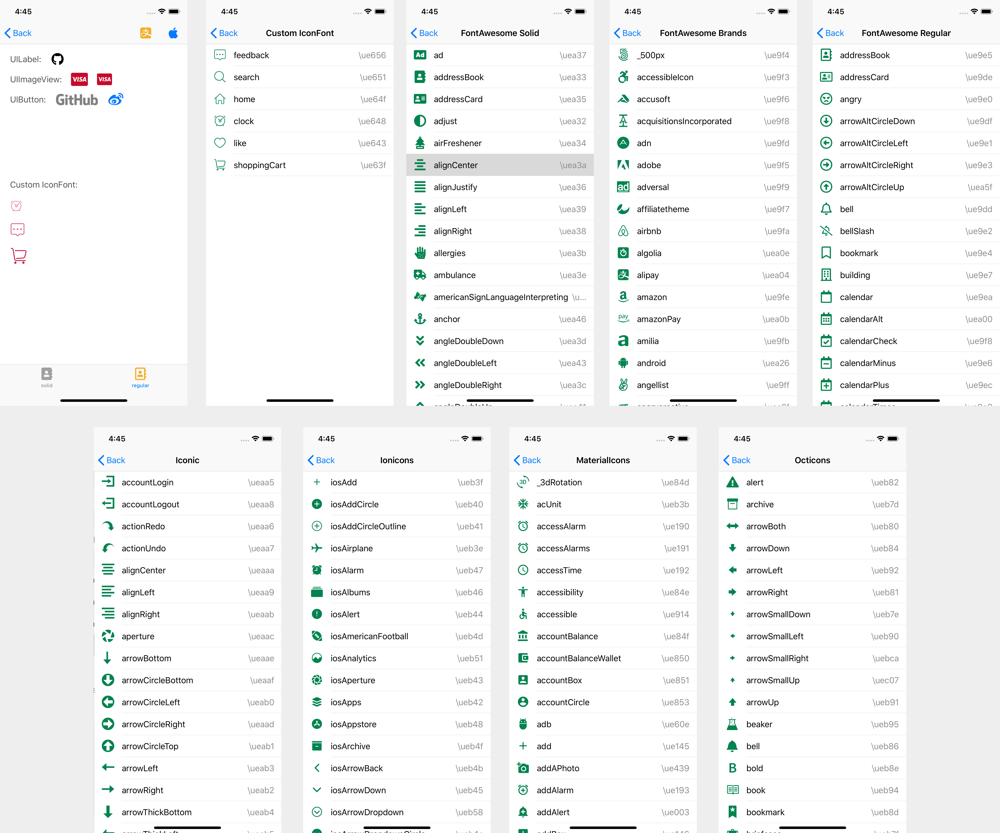

# IconFont

Use iconfont by Enum.

Support custom iconfont (you can make a custom iconfont from [iconfont.cn](http://www.iconfont.cn/)、[iconmoon](https://icomoon.io/))

Support open source icon : 

* [FontAwesome v5.8.1 (Free)](http://fontawesome.io/icons/)
* [Iconic v1.1.1](https://useiconic.com/open)
* [Ionicons v4.5.5](https://ionicons.com/)
* [MaterialIcons v3.0.1](https://github.com/google/material-design-icons)
* [Octicons v8.4.2](https://octicons.github.com/)

## CocoaPods

```
use_frameworks!
pod 'JustIconFont'

# support to FontAwesome、Iconic、Ionicons、MaterialIcons、Octicons
pod 'JustIconFont/FontAwesome'
pod 'JustIconFont/Iconic'		
pod 'JustIconFont/Ionicons'	
pod 'JustIconFont/MaterialIcons'	
pod 'JustIconFont/Octicons'
```

## Preview



## Usage

### Basic

Every icon can present as UIImage or NSAttributedString. 

> We can create UIImage with fontSize or imageSize. One is created according to the size of the font.  Another is created according to the size of the image.

```swift
// NSAttributedString
let attributedString = NSAttributedString.iconFont(Octicons.logoGithub, fontSize: 25)
label.attributedText = attributedString
button.setAttributedTitle(title: attributedString, for: .normal)

let attributes = NSAttributedString.attributes(with: Octicons.logoGithub, fontSize: 30)
tabBarItem.title = Octicons.logoGithub.unicode
tabBarItem.setTitleTextAttributes(attributes, for: .normal)

barButtonItem.title = Octicons.logoGithub.unicode
barButtonItem.setTitleTextAttributes(attributes, for: .normal)

// UIImage with fontSize. UIImage size is 39 * 30
let image = UIImage.iconFont(Octicons.logoGithub, fontSize: 30)
imageView.image = image
button.setImage(image, for: .normal)
tabBarItem.image = image
tabBarItem.selectedImage = image
barButtonItem.image = image

// UIImage with imageSize. UIImage size is 30 * 30
// image will scaled to fit with fixed aspect.
let image = UIImage.iconFont(Octicons.logoGithub, imageSize: CGSize(width: 30, height: 30))
imageView.image = image
```

### Extensions

There are some extensions for UIKit. 

#### UILabel

```swift
// use FontAwesome Brands
label.iconFont(size: 25, icon: FontAwesome.Brands.github)
label.iconFont(size: 25, icon: FontAwesome.Brands.github, color: .red)
```

#### UIImageView

```swift
// use Octicons
imageView.iconFont(Octicons.logoGithub) // imageSize = imageView.frame.size
imageView.iconFont(Octicons.logoGithub, fontSize: 30)
imageView.iconFont(Octicons.logoGithub, imageSize: CGSize(width: 30, height: 30))
```

#### UIButton

```swift
// if color is nil, icon's color is depend on `tintClor`
button.iconFont(Octicons.logoGithub, fontSize: 30)

button.iconFont(Octicons.logoGithub, fontSize: 30, color: .lightGray, for: .normal)
button.iconFont(Octicons.logoGithub, fontSize: 30, color: .red, for: .highlighted)
```

#### UIBarButtonItem

```swift
// use MaterialIcons
// if color is nil, icon's color is depend on `tintClor`
barButtonItem.iconFont(size: 25, icon: MaterialIcons.book)
barButtonItem.iconFont(size: 25, icon: MaterialIcons.book, color: color)
```
#### UITabBarItem
```swift
// use FontAwesome Solid
tabBarItem.title = "solid"
// if color is nil, icon will present the default color
tabBarItem.iconFont(FontAwesome.Solid.addressBook, fontSize: 25)
tabBarItem.iconFont(FontAwesome.Solid.addressBook, fontSize: 25, color: .red, for: .selected)

// use FontAwesome Regular
rightTabBarItem.title = "regular"
rightTabBarItem.iconFont(FontAwesome.Regular.addressBook, fontSize: 25)
rightTabBarItem.iconFont(FontAwesome.Regular.addressBook, fontSize: 25, color: .red, for: .selected)
```
## Custom IconFont

Custom IconFont should implement protocol IconFontType

### Create
```swift
public enum MyIconFont: String {
    case feedback = "\u{e656}"
    case search = "\u{e651}"
    case home = "\u{e64f}"
    case clock = "\u{e648}"
    case like = "\u{e643}"
    case shoppingCart = "\u{e63f}"
}

/// Implement protocol IconFontType
public extension MyIconFont: IconFontType {
    /// Font family name. The fully specified name of the font. 
    /// This name incorporates both the font family name and 
    /// the specific style information for the font.
    var name: String {
        return "iconfont"
    }
    
    ///  path of TTF file
    var filePath: String? {
        return Bundle.main.path(forResource: "iconfont", ofType: "ttf")
    }
    
    var unicode: String {
        return self.rawValue
    }
}

/// There is another way to setup custom iconfont
/// If your TTF file's name is equel to font family name
/// you just need to implement protocol IconFontEnumType and return font name
public extension MyIconFont: IconFontEnumType {
    var name: String {
        return "iconfont"
    }
}
```
### Usage
```swift
label.iconFont(MyIconFont.clock, fontSize: 25)
label.iconFont(MyIconFont.feedback, fontSize: 30)
label.iconFont(MyIconFont.shoppingCart, fontSize: 35)
```
